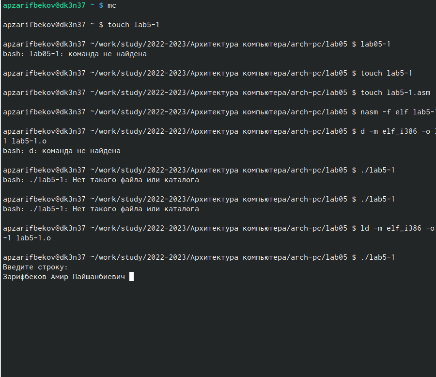

---
## Front matter
title: "Лабораторная работа №5"
subtitle: "Архитектура вычислительных систем"
author: "Зарифбеков Амир"

## Generic otions
lang: ru-RU
toc-title: "Содержание"

## Bibliography
bibliography: bib/cite.bib
csl: pandoc/csl/gost-r-7-0-5-2008-numeric.csl

## Pdf output format
toc: true # Table of contents
toc-depth: 2
lof: true # List of figures

fontsize: 12pt
linestretch: 1.5
papersize: a4
documentclass: scrreprt
## I18n polyglossia
polyglossia-lang:
  name: russian
  options:
	- spelling=modern
	- babelshorthands=true
polyglossia-otherlangs:
  name: english
## I18n babel
babel-lang: russian
babel-otherlangs: english
## Fonts
mainfont: PT Serif
romanfont: PT Serif
sansfont: PT Sans
monofont: PT Mono
mainfontoptions: Ligatures=TeX
romanfontoptions: Ligatures=TeX
sansfontoptions: Ligatures=TeX,Scale=MatchLowercase
monofontoptions: Scale=MatchLowercase,Scale=0.9
## Biblatex
biblatex: true
biblio-style: "gost-numeric"
biblatexoptions:
  - parentracker=true
  - backend=biber
  - hyperref=auto
  - language=auto
  - autolang=other*
  - citestyle=gost-numeric
## Pandoc-crossref LaTeX customization
figureTitle: "Рис."
tableTitle: "Таблица"
listingTitle: "Листинг"
lofTitle: "Список иллюстраций"
lotTitle: "Список таблиц"
lolTitle: "Листинги"
## Misc options
indent: true
header-includes:
  - \usepackage{indentfirst}
  - \usepackage{float} # keep figures where there are in the text
  - \floatplacement{figure}{H} # keep figures where there are in the text
---

# Цель работы

Приобретение практических навыков работы в Midnight Commander. Освоение инструкций языка ассемблера mov и int.

# Задание

    1. Создайте копию файла lab6-1.asm. Внесите изменения в программу (без использования внешнего файла in_out.asm), так чтобы она работала по следующему алгоритму: • вывести приглашение типа “Введите строку:”; • ввести строку с клавиатуры; • вывести введённую строку на экран
    2. Получите исполняемый файл и проверьте его работу. На приглашение ввести строку введите свою фамилию.
    3. Создайте копию файла lab6-2.asm. Исправьте текст программы с исполь- зования подпрограмм из внешнего файла in_out.asm, так чтобы она ра- ботала по следующему алгоритму: • вывести приглашение типа “Введите строку:”; • ввести строку с клавиатуры; • вывести введённую строку на экран.
    4. Создайте исполняемый файл и проверьте его работу.

# Выполнение лабораторной работы

1) . Откроем Midnight Commander используя команду mc. Пользуясь клавишами ↑ , ↓ и Enter перейдем в каталог созданный при выполнении лабораторной работы №4. С помощью клавиши F7 создем папку lab05 и перейдем в созданный каталог.

{ #fig:001 width=95% }

2) Пользуясь строкой ввода и командой touch создаем файл lab5-1.asm

{ #fig:002 width=95% } 

3) С помощью функциональной клавиши F4 откроем файл lab5-1.asm для редактирования во встроенном редакторе.Ввёл текст программы из листинга 6.1, сохранил изменения и закрыл файл.

{ #fig:003 width=95% } 

4)  С помощью функциональной клавиши F3 откроем файл lab6-1.asm для
просмотра. Убедились, что файл содержит текст программы.

{ #fig:004 width=95% } 

5) Оттранслировали текст программы lab5-1.asm в объектный файл. Выполнили компоновку объектного файла и запустил получившийся исполняемый файл.

{ #fig:005 width=95% } 

6) Скачал файл  in_out.asm. Скопировал файл в каталог с файлом lab5-1.asm

{ #fig:006 width=95% }

7) Создем копию файла lab5-1.asm с именем lab5-2.asm

{ #fig:007 width=95% }

8) Исправил текст программы в файле lab5-2.asm с использованием подпрограмм из внешнего файла in_out.asm В файле lab5-2.asm заменим подпрограмму sprintLF на sprint. Создаем исполняемый файл и проверили его работу. Разница в выводе текста.

{ #fig:008 width=95% }

{ #fig:009 width=95% }

# Выполнение самостоятельной работы

1) Создаем копию файла lab5-1.asm. Внесем изменения в программу. Получим исполняемый файл и проверим его работу. На приглашение ввести строку введем свою фамилию. Создаем копию файла lab5-2.asm. Исправим текст программы с использование подпрограмм из внешнего файла in_out.asm Создаем исполняемый файл и проверим его работу.

{ #fig:010 width=95% }

# Выводы

Я приобрели практические навыкови работы в Midnight Commander. И освоили иструкции языка ассемблера mov и int.

