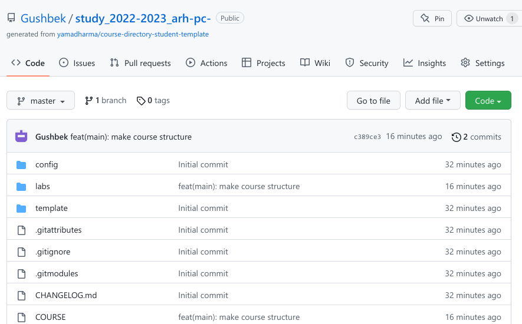

---
## Front matter
title: "Лабораторная работа №1"
subtitle: "Архитектура вычислитенльных систем "
author: "Зарифбеков Амир Пайшанбиевич "

## Generic otions
lang: ru-RU

## Bibliography
bibliography: bib/cite.bib
csl: pandoc/csl/gost-r-7-0-5-2008-numeric.csl

## Pdf output format

lof: true # List of figures
lot: true # List of tables
fontsize: 12pt
linestretch: 1.5
papersize: a4
documentclass: scrreprt
## I18n polyglossia
polyglossia-lang:
  name: russian
  options:
	- spelling=modern
	- babelshorthands=true
polyglossia-otherlangs:
  name: english
## I18n babel
babel-lang: russian
babel-otherlangs: english
## Fonts
mainfont: PT Serif
romanfont: PT Serif
sansfont: PT Sans
monofont: PT Mono
mainfontoptions: Ligatures=TeX
romanfontoptions: Ligatures=TeX
sansfontoptions: Ligatures=TeX,Scale=MatchLowercase
monofontoptions: Scale=MatchLowercase,Scale=0.9
## Biblatex
biblatex: true
biblio-style: "gost-numeric"
biblatexoptions:
  - parentracker=true
  - backend=biber
  - hyperref=auto
  - language=auto
  - autolang=other*
  - citestyle=gost-numeric
## Pandoc-crossref LaTeX customization
figureTitle: "Рис."
tableTitle: "Таблица"
listingTitle: "Листинг"
lofTitle: "Список иллюстраций"

lolTitle: "Листинги"
## Misc options
indent: true
header-includes:
  - \usepackage{indentfirst}
  - \usepackage{float} # keep figures where there are in the text
  - \floatplacement{figure}{H} # keep figures where there are in the text
---

# Цель работы

Целью работы является изучить идеологию и применение средств контроля.

# Задание

1. Создадим отчёт по выполнению лабораторной работы в соответствующем каталоге рабочего пространства ( labs>lab03>report).

2. Скопируем отчёты по выполнению предыдущих лабораторных работ в соответствующие катологи созданного рабочего пространства.

3. Загрузите файлы на github

# Выполнение лабораторной работы

Описываются проведённые действия, в качестве иллюстрации даётся ссылка на иллюстрацию (рис. [-@fig:001])

1. Создадим учётную запись на Github и заполним основные данные.

{ #fig:001 width=95% }

2.4.2 Базовая настройка git

 1.Сначала сделаем предварительную конфигурацию git. Откроем терминал и
введём следующие команды, указав имя и email владельца репозитория.Настроим utf-8 в выводе сообщений git. Зададим имя начальной ветки (будем называть её master).Параметр autocrlf. Параметр safecrlf.

{ #fig:002 width=95% }
 
 2.4.3 Создание SSH ключа.
 
  1.Сгенерируем пару ключей , необходимых для идентификации пользователя на сервере репозиториев.
  
  { #fig:003 width=95% }

  2.Скопировали из локальной консоли ключ в буфер обмена
  
{ #fig:004 width=95% }

 3.Вставляем ключ в появившееся на сайте поле и указываем для ключа имя (Title).
 
 { #fig:005 width=95% }
 
 2.4.4 Создание рабочего пространства и репозитория курса на основе шаблона.
 
 1.Откроем терминал и создадим катоалог для предмета " Архитектура компьютера "
 
 { #fig:006 width=95% }
 
 2.В открывшемся окне зададим имя репозитория (Repository name) study_2022_2023 и создадим репозиторий 
 
 { #fig:007 width=95% }
 
 
 3.Клонируем созданный репозиторий 
 
 { #fig:008 width=95% }
 
 2.4.6 Настройка каталога курса 
 
 1.Перейдём в каталог курса 
 
{ #fig:009 width=95% }

 2.Удалим лишние файлы 
 
 { #fig:010 width=95% }
 
 3.Создадим необходимые каталоги
 
 { #fig:011 width=95% }
 
 4.Отправьте файлы на сервер 
 
 { #fig:012 width=95% }
 
 { #fig:121 width=95% }
 
 { #fig:122 width=95% }
 
 5.Проверим правильность создания иерархии рабочего пространства в локальном репозитории и на странице github
 
  { #fig:013 width=95% }
  
  { #fig:014 width=95% }
   
   
  2.5 Задание для самостоятельной работы.
   
  1.Создал отчёт по выполнению лабораторной работы в соответствующем каталоге рабочего пространства
  ( labs>lab01>report)
  
  https://github.com/Gushbek/study_2022-2023_arh-pc-
  
  2.Скопировал отчёт по выполнению предыдущих работ в соответствующие каталоги созданного рабочего пространства . Перенёс Лабораторную №1 в соответствующий каталог (labs>lab01>report)
  
  { #fig:015 width=95% }
  
  3.Загрузил все эти файлы на github
  
# Вывод

В ходе лабороторной работы я изуил идеологию и пременение средства контроля версий. Приобрёл практичческие навыки по работе с системой git.

