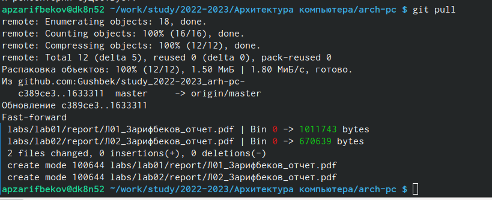

---
## Front matter
title: "Отчёт по лабораторной работе №3"
subtitle: "Архитектура вычислительных сисетм"
author: "Зарифбеков Амир Пайшанбиевич"

## Generic otions
lang: ru-RU
toc-title: "Содержание"

## Bibliography
bibliography: bib/cite.bib
csl: pandoc/csl/gost-r-7-0-5-2008-numeric.csl

## Pdf output format
toc: true # Table of contents
toc-depth: 2
lof: true # List of figures
lot: true # List of tables
fontsize: 12pt
linestretch: 1.5
papersize: a4
documentclass: scrreprt
## I18n polyglossia
polyglossia-lang:
  name: russian
  options:
	- spelling=modern
	- babelshorthands=true
polyglossia-otherlangs:
  name: english
## I18n babel
babel-lang: russian
babel-otherlangs: english
## Fonts
mainfont: PT Serif
romanfont: PT Serif
sansfont: PT Sans
monofont: PT Mono
mainfontoptions: Ligatures=TeX
romanfontoptions: Ligatures=TeX
sansfontoptions: Ligatures=TeX,Scale=MatchLowercase
monofontoptions: Scale=MatchLowercase,Scale=0.9
## Biblatex
biblatex: true
biblio-style: "gost-numeric"
biblatexoptions:
  - parentracker=true
  - backend=biber
  - hyperref=auto
  - language=auto
  - autolang=other*
  - citestyle=gost-numeric
## Pandoc-crossref LaTeX customization
figureTitle: "Рис."
tableTitle: "Таблица"
listingTitle: "Листинг"
lofTitle: "Список иллюстраций"
lotTitle: "Список таблиц"
lolTitle: "Листинги"
## Misc options
indent: true
header-includes:
  - \usepackage{indentfirst}
  - \usepackage{float} # keep figures where there are in the text
  - \floatplacement{figure}{H} # keep figures where there are in the text
---

# Цель работы

Целью работы является освоение процедуры оформления отчетов с помощью
легковесного языка разметки Markdown.

# Задание

1) В соответствующем катологе сделайте отчёт по лабораторной работе №3в формате Markdown.  В качестве отчёта необходимо предоставить отчёты в 3 форматах: pdf, docx и md.
2) Загрузите файлы на github.

# Выполнение лабораторной работы

Описываются проведённые действия, в качестве иллюстрации даётся ссылка на иллюстрацию (рис. [-@fig:001])

1. Откроем терминал. 

{ #fig:001 width=95% }

2. Перейдём в католог курса сформированный при выполнении лабораторной раоты №2.Обновить
 локальный репозитоий, скачав измененя из удалённого репозитория с помошью git pull.
 
{ #fig:002 width=95% }

3. Переходим в католог с шаблоном отчёта по лабороторной работе №2. Проведём компиляцию шаблона с использованием Makefile. Для этого введём команду make. Генерируется файлы report.pdf и report.docx.

{ #fig:003 width=95% }

4. Удаляем полученные файлы с использованием makefile. Для этого введём команду make clean.

{ #fig:004 width=95% }

5. Открываем файл report.md с помошью Markdown, gedit report.md. Заполняю данный отчёт и компелирую с использованием Makefile.

{ #fig:005 width=95% }

6. Загрузим всё на Github

# Выводы
Мы освоили основные процедуры оформления отчётов с помошью лёгковестного языка разметки Mardown.

