---
## Front matter
title: "Лабораторная работа №4"
subtitle: "Архитектура вычислительных систем"
author: "Зарифбеков Амир Пайшанбиевич"

## Generic otions
lang: ru-RU
toc-title: "Содержание"

## Bibliography
bibliography: bib/cite.bib
csl: pandoc/csl/gost-r-7-0-5-2008-numeric.csl

## Pdf output format
toc: true # Table of contents
toc-depth: 2
lof: true # List of figures
fontsize: 12pt
linestretch: 1.5
papersize: a4
documentclass: scrreprt
## I18n polyglossia
polyglossia-lang:
  name: russian
  options:
	- spelling=modern
	- babelshorthands=true
polyglossia-otherlangs:
  name: english
## I18n babel
babel-lang: russian
babel-otherlangs: english
## Fonts
mainfont: PT Serif
romanfont: PT Serif
sansfont: PT Sans
monofont: PT Mono
mainfontoptions: Ligatures=TeX
romanfontoptions: Ligatures=TeX
sansfontoptions: Ligatures=TeX,Scale=MatchLowercase
monofontoptions: Scale=MatchLowercase,Scale=0.9
## Biblatex
biblatex: true
biblio-style: "gost-numeric"
biblatexoptions:
  - parentracker=true
  - backend=biber
  - hyperref=auto
  - language=auto
  - autolang=other*
  - citestyle=gost-numeric
## Pandoc-crossref LaTeX customization
figureTitle: "Рис."
tableTitle: "Таблица"
listingTitle: "Листинг"
lofTitle: "Список иллюстраций"
lolTitle: "Листинги"
## Misc options
indent: true
header-includes:
  - \usepackage{indentfirst}
  - \usepackage{float} # keep figures where there are in the text
  - \floatplacement{figure}{H} # keep figures where there are in the text
---

# Цель работы

Освоение процедуры компиляции и сборки программ, написанных на ассем-
блере NASM

# Задание

1. В каталоге ~/work/arch-pc/lab05 с помощью команды cp создайте копию
файла hello.asm с именем lab5.asm
2. С помощью любого текстового редактора внесите изменения в текст про-
граммы в файле lab5.asm так, чтобы вместо Hello world! на экран выво-
дилась строка с вашими фамилией и именем.
3. Оттранслируйте полученный текст программы lab5.asm в объектный
файл. Выполните компоновку объектного файла и запустите получивший-
ся исполняемый файл.
4. Скопируйте файлы hello.asm и lab5.asm в Ваш локальный репозиторий
в каталог ~/work/study/2022-2023/"Архитектура компьютера"/arch-
pc/labs/lab05/. Загрузите файлы на Github.

# Выполнение лабораторной работы

 4.3.1. Программа Hello world!
 
1. рассмотрим пример просой программы на языке ассеблера NASM. Создадим каталог для работы с программами на языке ассембдера NASM.
Описываются проведённые действия, в качестве иллюстрации даётся ссылка на иллюстрацию (рис. [-@fig:001])

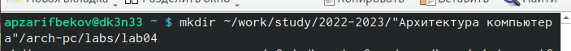{ #fig:001 width=90% }

2. Перейдём в созданный католог 

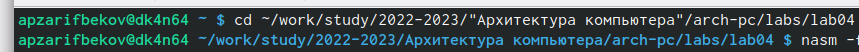{ #fig:002 width=90% }

3. Создадим текстовый файл с именем hello.asm

{ #fig:003 width=90% }

4. Откроем этот файл с помощью любого текстового редактора, например gedit

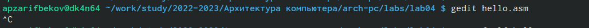{ #fig:004 width=90% }

и введём в него следующий текст:

 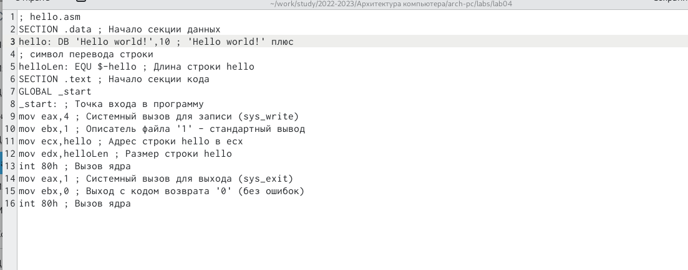{ #fig:005 width=90% }

4.3.2. Транслятор NASM
1. Напишем , необходимый для компеляции приведённого выше текст программы "Hello World"

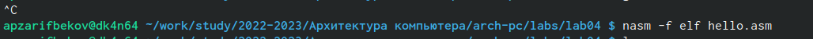{ #fig:006 width=90% }

2. С помошью ls проверим ,  что обьектный файл был создан 

{ #fig:007 width=90% }

4.3.3. Расширенный синтаксис командной строки NASM

1. Выплним следующую команду и спомошью ls проверим был ли создан файл
 
 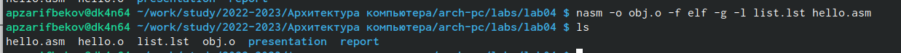{ #fig:008 width=90% }

4.4. Компоновщик JD

1. Чтобы получить исполняемую программу , обьектный файл необходимо передать на обработку компоноввщику c помошью ls проверим что был создан файл hello

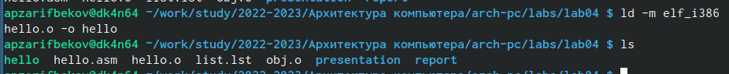{ #fig:009 width=90% }

2. Выполним следующую команду :

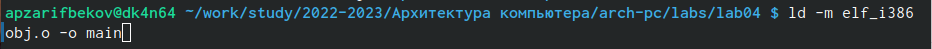{ #fig:010 width=90% }

3. Формат командной строки LD можно увидеть набрав id-help:

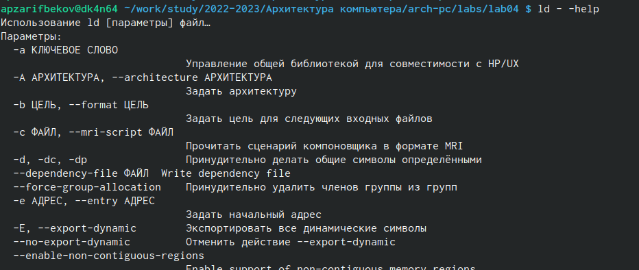{ #fig:011 width=90% }

4.4.1. Запуск исполняемого файла

1. Запустим на выполнение созданный исполняемый файл , находящийся в текущем катологе , набрав в командной строке :

{ #fig:012 width=90% }

4.5 Задание для самостоятелбной работы

1. В каталоге ~/work/arch-pc/lab05 с помощью команды cp создайте копию
файла hello.asm с именем lab5.asm

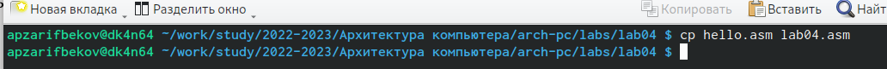{ #fig:013 width=90% }

2. С помощью любого текстового редактора внесите изменения в текст про-
граммы в файле lab5.asm так, чтобы вместо Hello world! на экран выво-
дилась строка с вашими фамилией и именем.

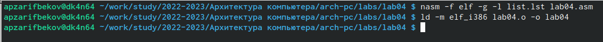{ #fig:014 width=90% }

3. . Оттранслируйте полученный текст программы lab5.asm в объектный
файл. Выполните компоновку объектного файла и запустите получивший-
ся исполняемый файл.

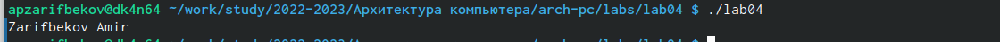{ #fig:015 width=90% }

# Выводы

Освоил процедуру компиляции и сборки программ, написанных на ассемблере NASM.
